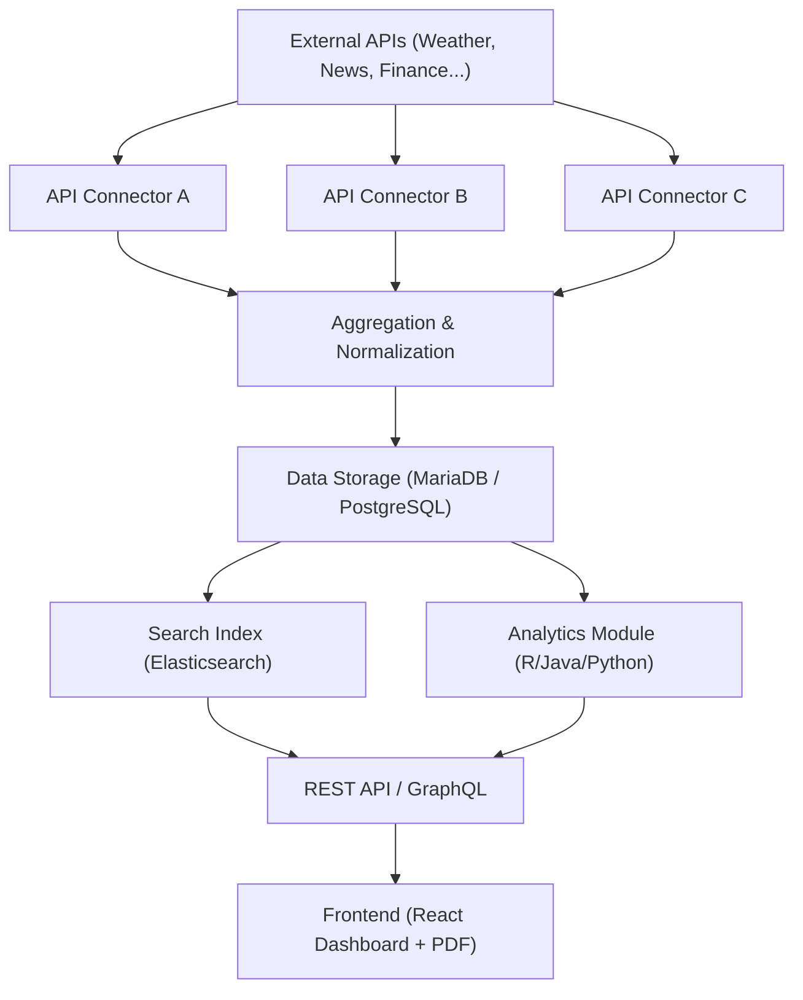

# 모듈형 API 통합·집계·검색 + 통계 분석 시스템

## 1. 프로젝트 개요

본 프로젝트는 여러 개의 외부 API 데이터를 모듈화된 방식으로 수집하고, 표준화/저장/집계 과정을 거쳐 사용자에게 검색/시각화/분석 결과(PDF 포함)를 제공하는 시스템이다.
새로운 API를 추가하거나 기존 API를 교체할 때 최소한의 수정으로 확장 가능한 **재사용성 높은 통합 플랫폼**을 목표로 한다.

---

## 2. 주요 목적

1. **API 데이터 통합**

   * 서로 다른 포맷(JSON, XML 등)을 표준화하여 일관된 구조로 저장한다.
2. **모듈형 설계**

   * 각 API 수집기를 독립 모듈로 구현하여 새로운 API 추가 시 재사용이 용이하다.
3. **데이터 집계 및 검색**

   * 통합된 데이터를 기반으로 필터링, 정렬, 통계, 검색이 가능하다.
4. **통계 분석 확장**

   * 저장된 데이터를 활용하여 **ANOVA, Kruskal-Wallis, Wilcoxon 검정** 등 유의성 검정을 수행한다.
   * ex1. 환경: 날씨·대기질 → 지역별 공기질 차이에 대해 Kruskal-Wallis 검정  
     ex2. 교통: 출근시간 교통량 → 주중 vs 주말 차이에 대해 Wilcoxon 검정
   * 시계열 분석(ARIMA 등), 회귀 분석으로 확장할 수 있다.
5. **시각화 및 제공**

   * 내부 API와 대시보드를 통해 검색 및 분석 결과를 제공한다.
   * **PDF 자동 보고서**를 생성하여 결과를 전달한다.

---

## 3. 시스템 아키텍처

**흐름:**
외부 API → 수집 모듈 → 표준화 처리 → DB 저장 → 집계/검색 서비스 → (선택) 분석 모듈 → 내부 API 제공 → 대시보드·PDF

**구성 요소**

* **외부 API 모듈**: 각 API별 독립된 수집 모듈
* **표준화 레이어**: JSON 스키마 변환, 필드 정규화, 단위 변환
* **DB 저장소**: 관계형 DB + 검색 인덱스 (예: PostgreSQL + Elasticsearch)
* **집계·검색 서비스**: 필터링, 정렬, 통계, 키워드 검색
* **분석 모듈**: R 또는 Java 기반 통계 분석 모듈
* **내부 API 게이트웨이**: REST API / GraphQL
* **대시보드**: React 기반 UI + PDF 출력

---

## 4. 특징 및 장점

* **확장성**: 새로운 API 추가 시 모듈만 붙이면 된다.
* **일반성**: 다양한 도메인(API 종류)에 재사용할 수 있다.
* **검색 최적화**: 인덱스 설계를 통해 빠른 질의를 지원한다.
* **분석 기능 강화**: 단순 집계가 아닌 **유의성 검정·시계열 분석·회귀 분석**까지 가능하다.
* **실무 연계성**: 기업 환경의 “외부 API 연동 → 내부 검색/분석 서비스” 패턴을 체험할 수 있다.
* **포트폴리오 가치**: 단순 CRUD가 아니라 **외부 연동 + 데이터 엔지니어링 + 통계 분석**을 모두 다루는 프로젝트이다.

---

## 5. 기술 스택

**Backend**

* Java 17
* Spring Boot 3.5.4
* REST API
* GraphQL (spring-boot-starter-graphql 3.5.4)
* Mybatis (mybatis-spring-boot-starter 3.0.3)
* JUnit5, MockMvc (테스트)

**Data & Storage**

* MariaDB 10.6.22
* PostgreSQL
* Elasticsearch (검색 최적화)
* Redis (캐싱)

**Frontend**

* React 19.1.1
* TypeScript 5.8.3
* NodeJs 22.15.0
* Axios 1.11.0
* Vite 7.1.3
* Recharts (데이터 시각화)
* Chakra-UI 3.24.2

**Analytics (미정)**

* R (통계 분석) 또는 Java 기반 라이브러리 (ANOVA, Kruskal-Wallis, Wilcoxon 등)
* Python (선택적으로 ARIMA, 회귀 분석 등 확장 가능)
* ReportLab (PDF 자동 보고서 생성)

**Infra & DevOps**

* Ubuntu 22.04.5 LTS
* Maven 3.9.11
* Docker
* Jenkins

---

## 6. 4주 로드맵 (MVP 기준)

### **1주차 – 프로젝트 기본 골격 잡기**

* Spring Boot 기반 백엔드 구조 세팅
* API 모듈 구조 정의 (Interface 설계)
* DB 스키마 설계 (Raw + 표준화 데이터)
* 기본 API 모듈 연동

### **2주차 – 집계 및 변환**

* 수집 데이터 표준화 DTO 변환
* DB 저장 파이프라인 구축 (원본 JSON + 표준화 Entity)
* 간단한 집계 기능 (최근 7일 통계, 사용자별 활동량 등)
* 에러 핸들링 및 재시도 로직 추가

### **3주차 – 검색 및 API 제공**

* 검색 기능 구현 (Mybatis 기반)
* 간단한 인덱싱 및 조회 최적화
* 자체 API 제공 (/search, /stats 등)
* React 대시보드 제작 (검색창 + 표/차트)
* 캐싱 추가 (API/검색 결과 캐시)

### **4주차 – 분석 확장 및 배포**

* 통계 분석 모듈 추가 (ANOVA, Kruskal-Wallis, Wilcoxon 등)
* PDF 자동 보고서 기능 구현
* API 확장 테스트 (두 번째 API 연동, 예: News API)
* 공통 모듈 리팩토링
* Docker 기반 배포 환경 구성
* 문서화 (README, API 사용법, 아키텍처 다이어그램)

---

## 7. 예상 결과물

* 최소 2개 외부 API 통합 및 표준화 DB 저장
* 검색 및 집계/조회 API 제공
* React 대시보드에서 시각화 가능
* 통계 검정 및 분석 모듈 동작 (PDF 리포트 포함)
* 구조적으로 다른 API도 손쉽게 추가 가능 (모듈화)
* 포트폴리오에 “**확장 가능한 API 통합·집계·검색 + 통계 분석 시스템**”으로 활용 가능

---

## 8. 아키텍처 다이어그램

